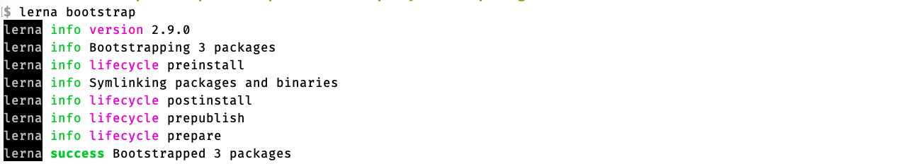

# dyn-forms

## Usando o Lerna

Lerna é uma ferramenta para gerenciar vários pacotes NPM em um único repositório.
Com o Lerna, podemos refatorar o nosso repositório para manter vários pacotes 
dentro dele.

O Lerna permite vincular dependências (usando `lerna bootstrap`) e versioná-las 
todas separadamente, ou mesmo juntas, conforme nossa escolha. No modo 
independente cada subpacote tem seu próprio **semver** e é atualizado quando 
suas dependências forem atualizadas.

O Lerna automatiza as tarefas para pacotes no conceito **monorepo**. 

### Subcomandos

O `lerna run build` executa o `npm run build` dentro de cada subpacote.

O `lerna publish` publica todos os pacotes para o `npm` e atualiza as tags git, 
dentro outras funcionalidades. Em seguida, os pacotes podem ser instalados 
facilmente a partir do registro do NPM.

OBS: para usar `lerna publish` você deve ter uma conta em 
[https://registry.npmjs.org](https://registry.npmjs.org) e se logar nela 
via `npm login`

Exemplo:

```bash
npm login 
Username: joao.parana
Password: *************
Email: (this IS public) joao.parana@gmail.com
Logged in as joao.parana on https://registry.npmjs.org/.
```

O Lerna requer um certo trabalho no início, quando já temos diversos repositórios 
independentes e queremos unificá-los, mas é uma maneira sólida de manter um 
pequeno número de pacotes principais em um único repositório e publicar cada 
um deles independentemente no NPM.

Alguns projetos de código aberto usam o Lerna para lidar com pacotes 
principais, incluindo Babel, Jest e Gatsby. Existem muitos tutoriais e posts 
sobre Lerna  na web. O Lerna é particularmente útil para gerenciar várias 
partes de um único projeto em um único repositório, ao mesmo tempo que cada 
um deles é um "mini-projeto" autônomo. Este é o caso típico dos WebComponents.

### Exemplo simples de monorepo

```bash
node -v
v10.17.0
npm -v
6.13.2
npm i lerna@2.9.0 -g
mkdir -p ~/Desktop/Development/components/monorepo/dyn-forms
cd ~/Desktop/Development/components/monorepo/dyn-forms
lerna init
cd packages
mkdir alpha
mkdir beta
mkdir usage
```

Para cada um dos diretórios de pacote fazer:

```bash
npm init -y
```

Isso criará os arquivos package.json simplificados

Ou seja:

```bash
for a in alpha beta usage 
do 
   echo •••• $a 
   cd $a
   npm init -y
   cd -
done
```

```bash
echo "module.exports = 'alpha'" > alpha/index.js
echo "module.exports = 'beta'"  > beta/index.js
echo "var alpha = require('alpha'); var beta = require('beta'); console.log(alpha + ' ' + beta)" > usage/index.js
```

```bash
lerna bootstrap 
```



E a arvore de diretório fica assim:


Podemos executar localmente e ver o resultado.

```bash
node ./packages/usage/index.js 
```

